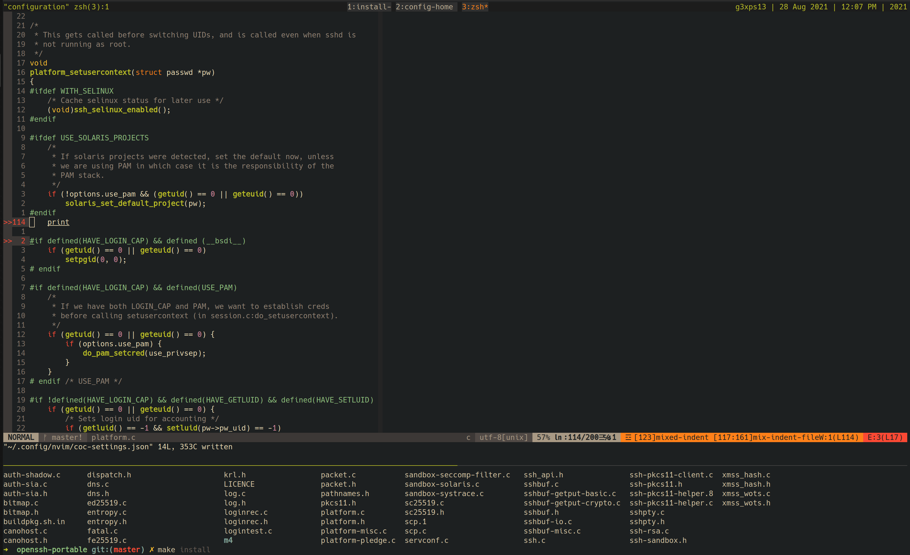

# terminalrc

A collection configurations for an awesome terminal experience.

### Configures and installs:

* bash
* zsh
* tmux
* neovim
* vim
* nerd fonts
  * SourceCodePro
  * FiraCode
* and gruvbox everywhere _for that sexy look!_

Plus the helpers!

* ripgrep, oh my zsh!, autojump, fzf

